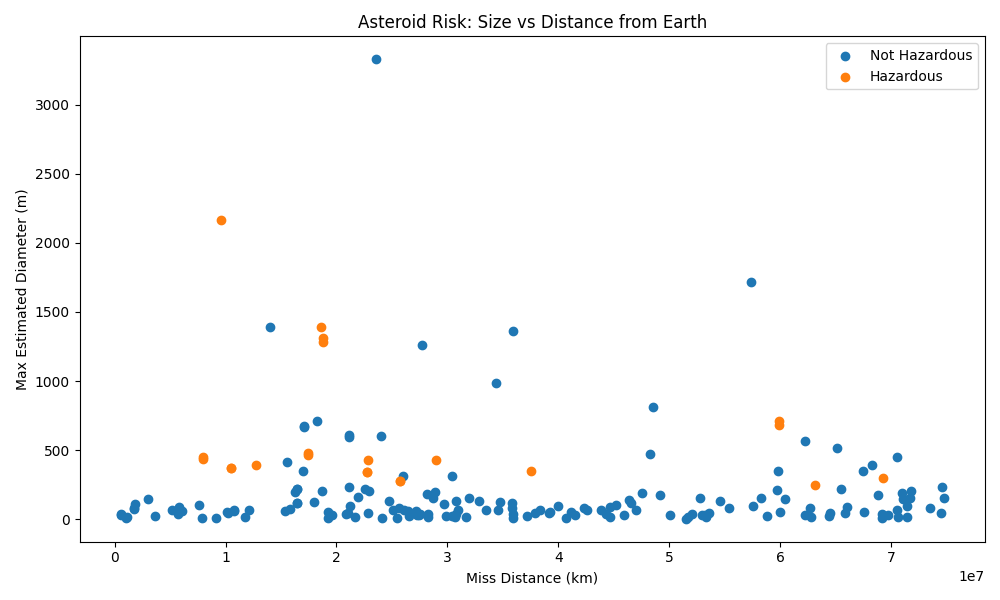

# Asteroid Risk Analyzer

A machine learning project using NASA Near-Earth Object data to analyze and classify potentially hazardous asteroids.

## Features
- Fetches real asteroid data from NASA API
- Processes telemetry (size, velocity, distance)
- Applies machine learning for risk analysis
- Visualizes asteroid risk patterns

## Model Performance

- Accuracy: ~86%
- Hazardous asteroid recall: 100%
- Demonstrates ability to detect all high-risk objects

Note: Dataset was initially imbalanced, addressed using class-weighted logistic regression and expanded data collection.

## Visualization

## Key Insight

Hazardous asteroids tend to be larger and closer to Earth, but no single feature fully determines risk. A machine learning model is effective for capturing these multi-factor relationships.